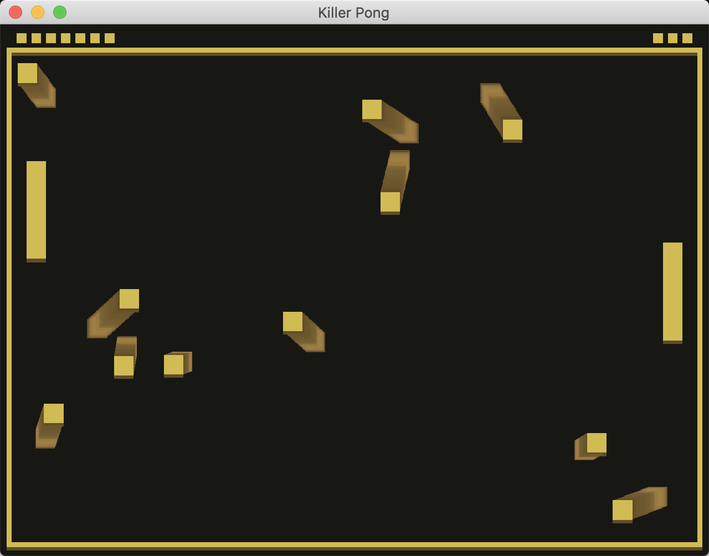

# Killer Pong

Author: Hao Wang

Design: Do not catch the ball! They are killers now! You control the paddle to avoid being hit by balls to survive. Number and speed of balls will increase as time goes by. You win by surviving longer that the right side AI.

Screen Shot:

How To Play:
Each player (you and the right side AI) initially has 15 HPs. A player will lose 1 HP if it was hit by a ball. When hitting by a ball, there is a 1 second invincible time for that player. Control the paddle by your mouse. Win the game by surviving longer than the right side AI.

This game was built with [NEST](NEST.md).
